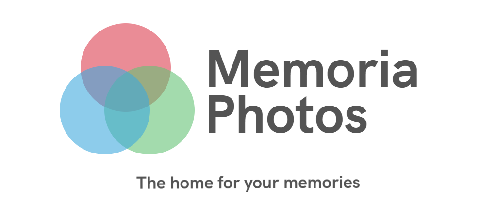

<p align="center">
  
</p>

## Description
Securely back-up your photos and videos to your own servers and enjoy them from anywhere.

## Why try it out?

* :left_right_arrow: **Automatic Sync:** You can store your photos and videos on a server of your choosing.

* 🙌 **All your photos, on all your devices:** Access every photo and video in your library — from any device, anytime you want.

* 🔒 **Designed to keep your photos private:** with our encryption mechanisms & JWT Authorization.

## Upcoming Features

* 🔒 **Two-factor Authentication:** We believe in privacy and want to take every step to support it

* ✨ **Reach more devices:** Upcoming support for Android, Web Apps & Streaming Devices.

* 📸 **No Limitations:** Upcoming Support for more media types — Live Photos, Portaits & Slow Motion

## Quick Setup

1. Install Docker and Docker-Compose

  - [Docker Install documentation](https://docs.docker.com/install/)
  
  - [Docker-Compose Install documentation](https://docs.docker.com/compose/install/)

2. Edit the docker-compose.yml if necessary

3. Bring up your stack by running

  ```bash
  docker-compose up -d
  ```

4. Access the server from either Apps

* 📱 [IOS App](https://docs.docker.com/compose/install/)

* 💻 [Web App](https://docs.docker.com/compose/install/)

## Join the team 👪

There are many ways to contribute, of which development is only one! Find out [how to get involved](https://discord.gg/zTN6hEPH9u), including designers, testers, helping others and much more! 😍

## Contact us

If you want to contact us, e.g. before starting a more complex feature, for questions
you can join us at the links below: http

* [💬 Join the Discord](https://discord.gg/zTN6hEPH9u)


## :scroll: License

Nest is [GPL-3.0](LICENSE) Licensed.
